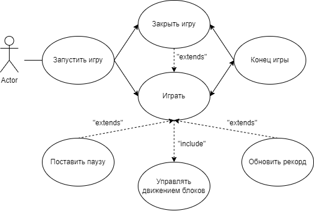
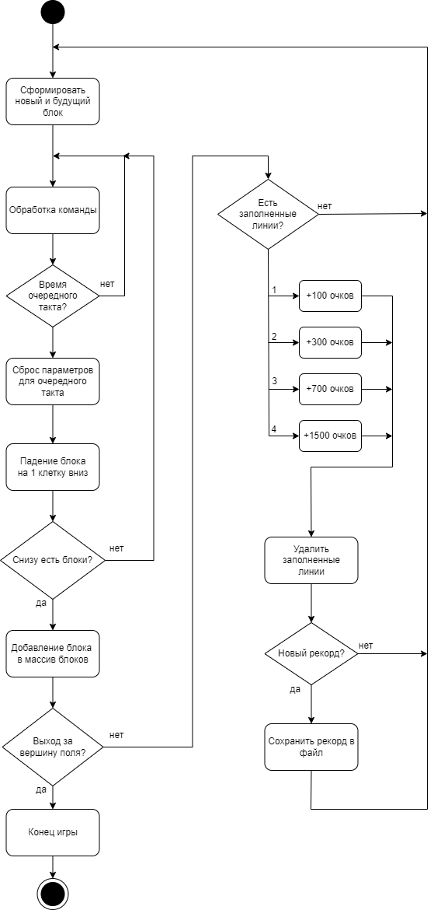

# SDS

## Введение

В этом документе описано объектно-ориентрованное проектирование приложению “Тетрис”.

## 1 Параметры проекта

### 1.1 Язык разработки

С++

### 1.2 Использующиеся библиотеки

SFML

### 1.3 Поддерживаемые платформы

Windows 7/10/11

## 2 Диаграмма классов

## 3 Use case

## 4 Поток событий

1. Пользователь нажимает на любую клавишу, начиная игровой процесс.
2. Пользователь начинает управлять падающими блоками используя следующие клавиши: Влево/A - перемещение блока влево, если это возможно; Вправо/D -  перемещение блока вправо, если это возможно; Вверх/Пробел/W - поворот блока по часовой стрелке, если это возможно; Вниз/S - ускорение падения блока; lAlt/rAlt - пауза.
3. При достижении падающим блоком нижней границы либо других блоков, он остановится и добавится в общий массив блоков.
4. Если массив блоков достиг верхней границы поля, то происходит проигрыш и игра заканчивается.
5. Если после падения блока, образовались целые линии, то они удаляются, оставшиеся блоки опускаются, начисляются очки: 1 линия - 100, 2 линии - 300, 3 линии - 700, 4 линии - 1500.
6. Если достигается рекордное количество очков, то они обновляются и сохраняются.
7. При достижении очередной отметки в 10/20/30/40/50/60/70/80/90/100 уничтоженных линий, блоки начинают падать быстрее.
8. При проигрыше можно закрыть игру, либо перезапустить и начать заново.

## 5 Диаграммы активности

Запуск игры.  
  

Обработка клавиш(команд).  
  

Падение блоков.  
  

## 6 Диаграммы последовательностей

Диаграмма последовательностей.  

## 7 Диаграммы состояния

Диаграмма состояния  

Стартовое окно  

Игровое окно  

Окно проигрыша  

## 8 Диаграмма компонентов

Так как приложение не имеет дополнительных компонентов и является одиночной файлов, диаграммы компонентов и развёртывания являются излишними.
