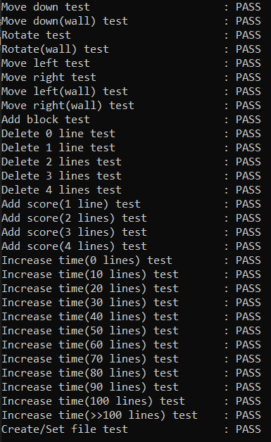

# 1. Введение
Этот план тестирования описывает подход и общую структуру тестирования для приложения Тетрис. В документе представлены:
* Стратегия тестирования: правила, на которых будет основано тестирование  
* Стратегия выполнения: описывает, как тест будет выполняться и обрабатываться для выявления дефектов и сообщения о них, а также для исправления и реализации исправлений  
* Описание тестов: организация и структура всех тестов, позволяющих убедиться в работоспособности приложения в полном объеме. 
* Результат тестирования.  

# 2. Стратегия тестирования
##  2.1 Цели теста
  Цель данного тестирования — убедиться, что все функциональные части приложения, отвечающие за правильность алгоритмов и их соответствие со спецификацией, корректны. Тесты будут выполнять отдельно взятые алгоритмы приложения и сверять с ожидаемыми значениями.
  
##  2.2 Объем и уровни тестирования
  Цель: Убедиться, что алгоритмы обработки блоков/фигур, работают корректно, недопустимые комбинации отсутствуют. Т.е. перемещение и поворот блоков осуществляется без ошибок, подсчет линий и начисление очков ведется правильно.  
  Тестер: программа на языке программирования С++
  
# 3. Описание тестов
## 3.1 Падение блока
  В данном случае рассматривается два варианта падения блока. В первом варианте осуществляется стандартный вариант события: изменяются Y-координаты фигуры и сравниваются с ожидаемыми. Полученные координаты должны совпадать с теоретическими.
  Второй вариант события: невозможность падения блока, в связи с наличием под падающим блоком нижней границы поля, либо "стены" из предыдущих блоков. Результатом теста является определение возможности падения блока, т.е. изменения Y-координат.
  
## 3.2 Перемещение блока влево и права
  В данный пункт входит сразу 4 теста. В первом случае проверяется корректность перемещения блока в левую сторону. Во время теста определяется правильное изменение X-координат влево на 1: координаты, полученные в результате работы метода должны соответствовать предполагаемым.
  Во втором тесте определяется наличие возможности сдвига блока влево. Блок нельзя сдвинуть влево из-за левой границы или накопившейся "стены" из предыдущих блоков. Тест должен определить корректность работы алгоритма.
  Третий тест аналогичен первому тесту, а четвертый - второму. Их отличие заключается в направлении смещения блока. В третьем и четвертом тесте сдвиг происходит вправо.
  
## 3.3 Поворот блока по часовой стрелке
  Данный пункт включает в себя два теста. Первый тест определяет корректность поворота падающей фигуры. В ходе теста сравниваются координаты блока после поворота по часовой стрелке и ожидаемые координаты блока.
  Второй тест предполагает проверку алгоритма с учетом границ поля либо "стены" из предыдущих блоков. В алгоритм поворота уже заложено определение выхода блока за левую и правую границу, поэтому алгоритм также изменяет координаты фигуры на допустимые. Таким образом реализован поворот блоков у края поля. Тест должен проверить корректность координат блока после поворота у границы поля.
  
## 3.4 Удаление линий
  Данный тест определяет корректность удаления линий. На вход теста подается количество полностью заполненных линий, и тест сам заполняет игровое поле "стеной" из блоков согласно переданному количеству. После вызывается метод удаляющий линии и определяющий их количество. Удаляемое количество должно совпасть с предполагаемым.

## 3.5 Начисление очков
  В данном тесте проверяется корректность начисления очков за уничтоженные линии, согласно описанным требованиям. На вход теста подается количество уничтоженных линий, а сам тест должен проверить правильно ли алгоритм начисляет очки: 1 линия - 100 очков, 2 линии - 300 очков, 3 линии - 700 очков, 4 линии - 700 очков. Тест сравнивает полученное количество очков с предполагаемыми.
  
## 3.6 Ускорение падения блоков
  После удаления определенного количества линий, задержка между тактами уменьшается. Данный тест определяет корректность вычисления временной задержи между тактами, согласно запрашиваемому количеству линий. 
 
## 3.7 Работа с файлом
  При инициализации проверки игры происходит считывание очков из файла, при наборе рекордного количества очков, даныые в файле обновляются. Данный тест предназначен для проверки работспособности функций связанных с работой с файлом. А ходе теста, проверяется: создается ли файл и возможно ли  корректно записать в него данные.

# 4 Результаты тестирования

  
  
